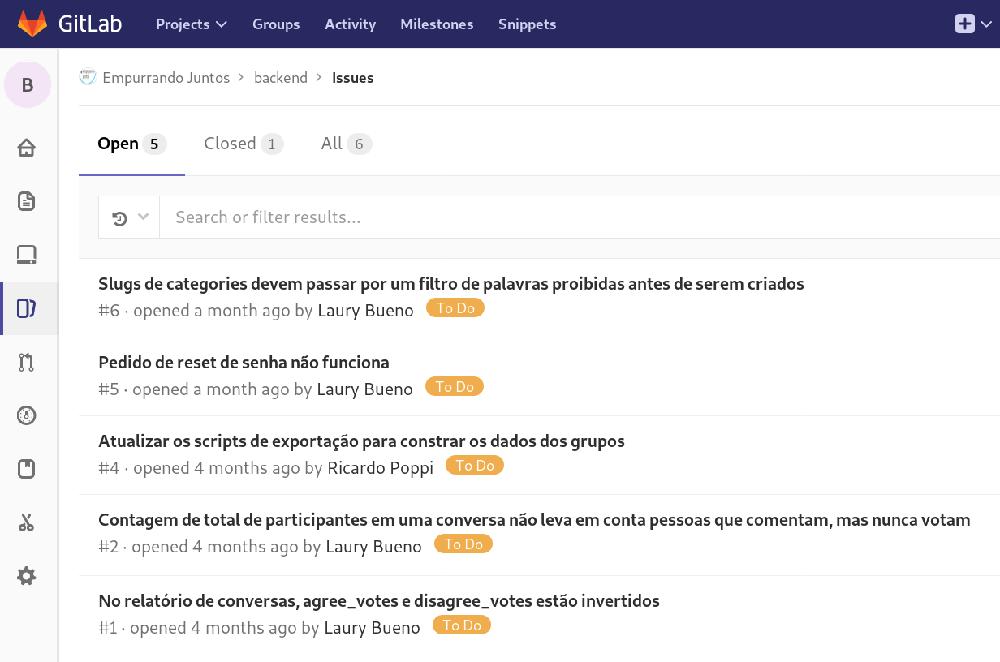
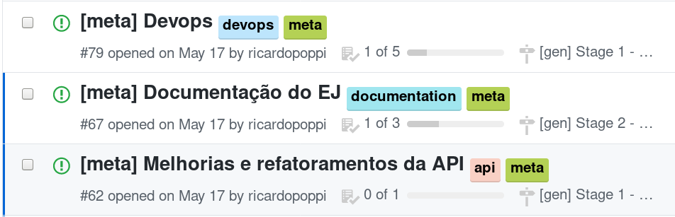
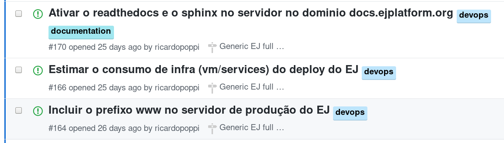
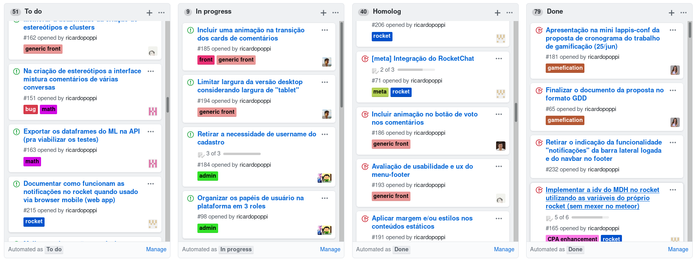
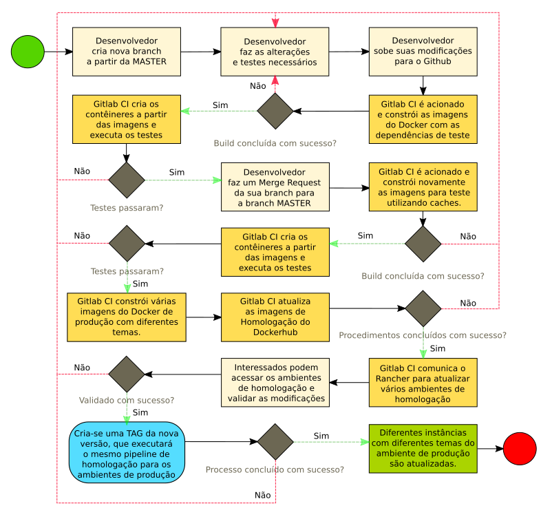

\newpage
# Metodologia {#sec:metodologia}

Neste Capítulo explicaremos como organizamos todo o ecossistema de colaboradores, as ferramentas que nos auxiliaram e os fundamentos práticos de metodologias de desenvolvimento ágeis que nortearam todo o processo de criação do Empurrando Juntos.

## Comunidade Empurrando Juntos

Este projeto nasceu de uma proposta do Intituto Cidade Democrática a um workshop internacional realizado em Madri, na Espanha. Lá, foram construídos seus primeiros protótipos e discutidas suas principais características por uma equipe composta de cientistas políticos, _designers_, engenheiros de _software_, estudantes, jornalistas e ativistas de diversas nacionalidades. Neste momento, instituiu-se a primeira comunidade em torno do desenvolvimento da plataforma. Figuras importantes, como o cofundador do Pol.is, Colin Megill, e a ministra digital de Taiwan, Audrey Tang, além de todos os participantes do evento, interagiram com nossa equipe e tiveram um primeiro contato com o arquétipo que originaria o projeto aqui apresentado.

Após o evento, o Instituto Cidade Democrática realizou estudos, testes e pesquisas que fundamentaram a decisão de diversos aspectos conceituais da plataforma. No mesmo período, a interação com a comunidade do Pol.is ganhou contornos estratégicos por meio do trabalho de Martins [-@tall17], que estabeleceu um estudo aprofundado sobre sua arquitetura. Neste contexto, em Agosto de 2017, a Fundação Perceu Abramo, através do projeto "Brasil que o Povo Quer"^[https://brasilqueopovoquer.org], financiou o laboratório de _Software_ Livre, Hacklab, de São Paulo, no desenvolvimento da primeira versão oficial do Empurrando Juntos. Este projeto envolveu entre outros participantes, estudantes do curso de Engenharia de _Software_ da Universidade de Brasília. Este foi o marco para o início do presente trabalho.

O contexto específico das primeiras versões do Empurrando Juntos embasou uma série de tomadas de decisão sobre as formas como a ferramenta seria implantada na sociedade. Assim, em Fevereiro de 2018, o Laboratório Avançado de Produção Pesquisa e Inovação em Software (LAPPIS) da Universidade de Brasília e o Instituto Cidade Democrática, em comum acordo com o Hacklab, instauraram a primeira frente de desenvolvimento de um Empurrado Juntos genérico, que pudesse ser aplicado a diferentes contextos sociais.

Atualmente, aproximadamente 40 pessoas de 12 organizações compõem uma comunidade ativa deste _Software_ Livre. Já atuaram em torno de três experimentos e quatro protótipos de teste, que juntos mobilizaram mais de 150 mil votos, realizados por milhares de pessoas.

## Metodologias de desenvolvimento

O deselvolvimento deste trabalho pode ser dividido em dois momentos distintos. O primeiro, no âmbito do projeto "Brasil que o Povo Quer" do Hacklab, o segundo, a elaboração de um Empurrando Juntos genérico e flexível, que pudesse ser aplicado em diferentes contextos.

### Projeto Brasil Que o Povo Quer

Este projeto mobilizou cerca de 15 pessoas de diferentes perfís trabalhando remotamente em diversas regiões do país. Formou-se uma camada de coordenação que intermediava as discussões com a Fundação Perseu Abramo e então atribuia objetivos de trabalho de curto e médio prazo para as equipes de desenvolvimento.

O projeto e a implementação do _ej-server_ e do _ej-math_ aconteceram em momentos diferentes e guiados por metologias de desenvolvimento distintas. O _App_ de conversas do _django_ foi a primeira entidade a ser projetada e implementada. Esse processo contou com diversos atores que foram responsáveis por, além de auxiliar no desenvolvimento, validar a solução construída e sugerir mudanças e melhorias.

A metodologia utilizada foi fortemente embasada em trabalhos anteriores realizados no Hacklab. Apesar disso, se apoiou inicialmente na primeira experiência do laboratório com a plataforma de gestão de projetos Taiga^[https://taiga.io], mostrada na [@fig:taiga]. As integrações limitadas que essa ferramenta continha, o alto custo operacional de se manter um ambiente completo de gestão atualizado para um contexto relativamente pequenho de desenvolvimento, e outros fatores negativos, culminaram em recursivas defasagens em relação às discussões e implementações e, consequentemente, a opção por abandonar a plataforma.

{#fig:taiga width=430px height=210px}

Para a integração das pessoas, passamos a utilizar extensivamente tecnologias de comunicação ágeis, como a plataforma de mensageria Telegram e os serviços de vídeo conferência Appear^[https://appear.in/] e Google Hangouts^[https://hangouts.google.com]. Essas reuniões eram curtas, realizadas frequentemente para a tomada de decisões estratégicas para o desenvolvimento e também para o rápido alinhamento das diferentes equipes: _designers_, desenvolvedores de _frontend_ e _backend_, coordenadores, etc.

Decidimos utilizar os próprios repositórios remotos para organizar o projeto, simplificando o acesso para os desenvolvedores e agilizando os processos de contribuição. Além disso, essa decisão foi tomada em benefício da fomação de uma comunidade de _Software_ Livre transparente e dinâmica, buscando fomentar o ingresso de interessados.

### Gitlab

Para a alocação de tarefas, discussão de problemas e melhorias, e principalmente como repositório remoto Git, utilizamos o serviço Gitlab^[https://gitlab.com/empurrandojuntos/], veja na [@fig:gitlab]. _Issues_ eram criadas e rotuladas de acordo com a importância e as características da tarefa a ser feita. Os coordenadores do projeto indicavam pontos de melhoria, solicitavam novos recursos e validavam as soluções apresentavas através desse sistema.

{#fig:gitlab width=385px height=260px}

A decisão por utilizar o Gitlab em detrimento do Github partiu do Hacklab e condiz com as práticas adotadas por diversos laboratórios de _Software_ Livre brasileiros, que buscam tecnologias alternativas Livres para compor seus modelos de negócio. Apesar da menor visibilidade em relação à projetos no Github, por exemplo, há uma série de vantagens na escolha dessa ferramenta. Podemos citar as principais:

* _Software_ Livre, distribuído pela licença MIT;
* Serviço de Integração Contínua nativo e ilimitado;
* Serviço de Integração Contínua com suporte para Docker;
* Ambiente integrado ao repositório remoto para registro de imagens Docker;
* Integração nativa com a ferramenta Kubernetes para orquestração de contêineres Docker;

Explicaremos a procura por um ambiente adaptado à infraestruturas projetadas sobre o Docker na [@sec:docker]. Antes, é necessário esclarecer como é realizado o fluxo de alterações no código do Empurrando Juntos.

### Gitflow

Para coordenar o processo de contribuição de cada um dos desenvolvedores, utilizamos o modelo de ramificações do Git (do inglês, _Git Branching Model_) chamado Gitflow. Esse modelo é uma estratégia sistemática de alterações no código, que estabelece um fluxo regular ao qual qualquer modificação no _software_ é submetida. Em outras palavras, ele define uma hierarquia de _branches_ e um caminho que os _commits_ devem seguir passando por elas até o nível mais alto dessa hierarquia, a _branch master_, veja na [@fig:gitflow]. Os dois últimos níveis serão associados aos ambientes de homologação e produção do _software_, falaremos sobre isso na [@sec:integracaocontinua].

![Modelo de Ramificações Gitflow^[Fonte: https://goo.gl/CB6CJP]](images/metodologia/gitflow.png){#fig:gitflow width=385px height=260px}

O Gitflow nos ajudou a melhorar a organização de duas áreas: a gerencia de configuração e a gerencia de projetos. Através dessa sistematização facilitamos o processo de inclusão e manutenção de código, assim como suavisamos a curva de aprendizado de novos contribuidores, que podem se embasar em diversos casos práticos já documentados na _Internet_ ou optar por utilizar a ferramenta _gitflow_, que foi construída como uma abtração do _git_ para esse modelo de ramificações.

### _Test Driven Development_

O desenvolvimento guiado por testes é um método de desenvolvimento de _software_ baseado em curtos ciclos de repetições em que o desenvolvedor primeiramente escreve um conjunto de testes automatizados que garantam os critérios de aceitação para uma futura melhoria ou funcionalidade e, só então, desenvolve o código que tem como objetivo ser válido para os testes implementados. No contexto desse trabalho, essa técnica foi aplicada principalmente para o desenvolvimento do _ej-math_.

A técnica não foi aplicada por todas as pessoas do time no desenvolvimento dos diferentes _Apps_ do _ej-server_. Inclusive, podemos citar uma defasagem de diversas modelos em relação à implementação de testes automatizados, o que prejudicou algumas tentativas de refatoração e a própria instauração de um processo de Integração Contínua, como veremos na [@sec:integracaocontinua]. Esse estado se agravou de acordo com as dinâmicas de entrega, as pressões por parte dos interessados e o cunjunto reduzido de programadores para a implementação de diversas funcionalidades.

É importante frisar que esse modelo de desenvolvimento oferece mais do que um _framework_ de validação e de correção. Ele pode ser usado para orientar a arquitetura de um _software_. Isso acontece graças ao potêncial de privilegiar a visão das interfaces e integrações, já que para implementar os testes deve-se imaginar como determinada função será utilizada. Essa característica tende a aumentar a conformidade com os requisitos funcionais e não funcionais do sistema.

### Integração Contínua {#sec:integracaocontinua}

Os testes automatizados foram escritos com o auxílio da biblioteca de testes _pytest_ através do pacote _pytest-django_. Este _framework_ facilita a escrita de pequenas unidades de teste, diminuindo o esforço para compreender e desenvolver robustas suítes unitárias e funcionais. Cada conjunto deve ser extendido e aprimorado com o tempo de projeto, de acordo com os trabalhos de implementação e manutenção de funcionalidades.

A elaboração sistemática de testes automatizados possibilita que a integração de diferentes alterações no código sejam realizadas com menor custo operacional. Essa é uma das principais características de metodologias de desenvolvimento ágeis, que se sustentam na utilização de várias tecnologias de apoio ao desenvolvimento de código. Nesse aspecto, as ferramentas empregadas permitiram entregas rápidas, com pequenas e frequentes modificações no _software_. Assim, o trabalho em paralelo dos membros da equipe de desenvolvimento tornou-se não só possível, como incentivado.

O Gitlab possui um sistema nativo de Integração Contínua. Esse sistema permite a execução de rotinas de teste quando detecta uma nova alteração no código. Toda mudança realizada dispara automaticamente o conjunto de testes para aquela versão do código, permitindo que os desenvolvedores tomem ciência imedita sobre falhas e erros que podem ter ocorrido na incorporação daquele novo trecho do programa.

Alinhado aos princípios do Gitflow, assim que um erro é acusado pelos testes, o desenvolvedor responsável deve suspender qualquer pedido de integração com _branches_ de maior hierarquia. Após a análise dos erros e da correção das causas, um novo pedido de integração deve ser realizado. Desta forma, a Integração Contínua é a principal tecnologia de apoio ao fluxo proposto pelo Gitflow, que não deve jamais ser violado nessas circunstâncias.

### Entrega Contínua e _Deploy_ Contínuo

Outra prática adotada foi a Entrega Contínua das alterações realizadas no código. No momento em que as integrações foram testadas e os desenvolvedores entenderam que estão prontas para as validações finais, antes que sejam disponibilizadas aos usuários, é realizado o processo de implantação automatizada do novo _software_ no ambiente de homologação, que antecede o de produção. Isso permite os principais envolvidos no desenvolvimento terem contato imediato com as funcionalidades criadas ou modificadas, de forma que se mantenha ao menos um nível de validações realizadas de forma não automatizada, a fim de perceber possíveis alterações que ainda devem ser feitas.

Após todas alterações, testes e validações, a nova versão do _software_ estará pronta para ser disponibilizada aos usuários finais, no último nível do Gitflow. Então, entra em cena a prática de _Deploy Contínuo_, que pode ser descrita como a realização de um conjunto de tarefas automatizadas que substituem a versão antiga do sistema pela nova no ambiente de produção. Apesar de não serem exclusivos, esses procedimentos foram pensados especialmente para sistemas _Web_, com o intuito de promover a independência dos desenvolvedores em um ecossistema de desenvolvimento ágil. Assim, as diferentes equipes têm capacidade de aplicar suas alterações em produção de forma autônoma, tornando-se diretamentamente responsáveis por questões de qualidade e confiabilidade das funcionalidades que implantaram.

### Docker {#sec:docker}

Tudo isso é possível graças a utilização de uma tecnologia que existe há vários anos, porém tem ganhado um destaque gigantesco no universo da computação. O Docker é uma plataforma aberta voltada para desenvolvedores que permite a construção, a disponibilização e a execução de aplicações em ambientes Linux isolados, os contêineres. É a ferramenta sobre a qual o Empurrando Juntos baseia todos seus procedimentos de Integração, Entrega e _Deploy_ contínuos. Com ela, é possível empacotar os diferentes sistemas que compõem a aplicação dentro de contêineres e então, torná-las portáveis para qualquer outro sistema que possua o Docker instalado. Apesar de possuir algumas características semelhantes, não pode ser descrito como um sistema de virtualização tradicional. Na verdade, enquanto um ambiente de virtualização tradicional possui um Sistema Operacional completo e isolado, o Docker compartilha uma série de bibliotecas do Kernel com a máquina _Host_, característica que flexibiliza e simplifica drasticamente a criação, manutenção e execução desses sistemas.

[TODO] descrição de containeres, docker, virtualização (usar aquelas imagens explicativas).

Sua utilização reduz drasticamente o tempo e a complexidade da implantação das aplicações, já que um ambiente isolado para o correto funcionamento do serviço foi configurado previamente. Desta forma, garantimos que o ambiente inicial será imutável para qualquer instalação, podendo então replicá-lo quantas vezes forem necessárias.

O Empurrando Juntos é um sistema distribuído, como vimos na [@fig:sisej]. Cada um dos subsistemas é um contêiner Linux isolado que se comunica com os outros através de uma rede virtual construída automaticamente pelo Docker. Configuramos três ambientes distintos para esse conjunto de contêineres. O ambiente de testes é construído a partir da instalação e da configuração mínima exigida para a execução dos testes. O ambiente de desenvolvimento é configurado com os recursos necessários para a execução completa do sistema nos ambientes dos desenvolvedores. Por último, o ambiente de produção é construído pensando na implantação nos servidores de homologação e produção.

A ferramenta de Integração Contínua, Gitlab CI, não serve apenas para a execução de testes. Nela, podemos configurar, através de _scripts_, ações que serão realizadas de forma sequencial ou paralela de acordo com condições preestabelecidas. Chamamos esse conjunto de ações condicionais de _pipeline_. Vejamos na [@fig:pipeline] uma representação visual da integração entre Gitflow, Gitlab, _pytest_ e Docker.

{#fig:pipeline width=350px height=400px}

Observe na figura que é sempre papel do desenvolvedor cuidar de todos os procedimentos e problemas provenientes das suas alterações. É possível notar a quantidade de passos automatizados e como, em diversas etapas do _pipeline_, o processo é redundante. Essa característica é desejada, visto que em uma metodologia que busca otimizar a entregabilidade deve ser extremamente rigorosa em relação à possíveis falhas e erros.

As imagens geradas são distribuídas através do serviço Registry do Gitlab, um repositório de imagens Docker. Desta forma, sempre que a construção de uma nova versão do _software_ for concluída com sucesso, atualizamos a última versão do Empurrando Juntos registrada, rotulando essa nova imagem como _latest_. Também mantemos todas as versões anteriores com os rótulos referentes ao nome de cada versão. Assim mantemos a compatibilidade com sistemas construídos a partir de imagens antigas.

### Rancher

Rancher^[https://rancher.com/] é um _software Open Source_, distribuido sob os termos da licença Apache 2.0, que possibilita a criação de um ambiente privado para manipulação de contêineres Docker. Através dele é possível administrar todo o ecossistema de serviços de uma organização que são distribuídos através de imagens Docker. O Rancher gerencia diversos recursos, como orquestração, _loadbalance_, _volumes_, rede, grupos de usuários e permissões, etc. Todos esses recursos são facilmente manipulados através de uma interface _Web_ completa (veja na [@fig:rancher]), que pode ser acessada por qualquer um dos desenvolvedores com credenciais.

{#fig:rancher width=400px height=250px}

É possível manipular seus recursos através de uma _Web API_ acessada através de _Tokens_. Desta forma permitimos o Gitlab atualizar o Empurrando Juntos em nossa infraestrutura de homologação e produção assim que as condições são obedecidas. O processo se baseia na disponibilização das imagens Docker construídas pelo Gitlab CI, que então realiza uma solicitação de atualização para o Rancher através de sua _API_. O Rancher realiza verificações de segurança e então atualiza os contêineres Docker solicitadas, fazendo um novo _download_ da versão _latest_ cadastrada no Registry do Gitlab.

O Rancher trabalha com um sistema de redirecionamento inteligente que não desliga a versão antiga de um sistema enquanto a nova não estiver completamente configurada e operante. Assim que a nova versão estiver pronta para ser usada, ele redireciona os acessos para ela, garantindo total disponibilidade dos serviços durante os procedimentos internos de atualização.

Qualquer atualização de contêineres no Rancher pode ser revertida sem maiores prejuízos. Assim, se alguma alteração não testada passar por todo o processo de Integração Contínua sem disparar erros e chegar a ser disponibilizada, podemos voltar imediatamente à versão antiga.

### Documentação

Os procedimentos para configuração de ambientes de produção e desenvolvimento foram escritos nos respectivos repositórios de cada componente do Empurrando Juntos. Essa documentação assume que seus usuários estarão utilizando Docker. Também foram descritos os meios para a execução dos testes, visando uma futura interação com a comunidade de desenvolvedores.

A _API_ foi documentada automaticamente através de recursos disponibilizados pelo _Django Rest Framework_. É possível navegar entre os diferentes _endpoints_ e realizar testes manuais em cada um deles.

Todos os métodos desenvolvidos neste trabalho foram documentados em nível de código por comentários. Esses comentários descrevem sucintamente as entradas esperadas, o procedimento realizado e a saída. Em casos específicos onde mecanismos complexos do _Django_ ou do _Python_ foram exigidos, seções explicativas foram anexadas no corpo dos métodos.

### Licença de _software_

Em decisão unânime entre o Instituto Cidade Democrática, o Hacklab e o LAPPIS-UnB, foi atribuída a todos os componentes do Empurrando Juntos a licença AGPLv3 (GNU Affero General Public License^[https://www.gnu.org/licenses/agpl-3.0.en.html]). É uma licença _copyleft_ gratuita para _softwares_ e outros trabalhos, que busca garantir a cooperação com a comunidade difundida através da _Internet_.

Essa licença para _softwares_ livres possui o benefício de defender a liberdade de todos os usuários em relação as melhorias feitas em versões alternativas do programa, já que estas devem estar necessariamente disponíveis e atualizadas para outros desenvolvedores. Enquanto a licença GPLv3 (GNU General Public License^[https://www.gnu.org/licenses/gpl-3.0.en.html]) permite fazer uma versão modificada e incoporá-la a um _Website_ de acesso público sem disponibilizar seu código fonte, a versão Affero foi desenvolvida para evitar esse tipo de situação. Assim, garantimos o direito de acesso ao código fonte de qualqeur versão alternativa do Empurrando Juntos.

### Projeto Empurrando Juntos Genérico

A partir do momento em que o Empurrando Juntos passa a integrar o conjunto de soluções desenvolvidas pelo laboratório LAPPIS, diversas alterações estruturais nas metodologias de trabalho foram realizadas. Essas modificações tiveram como base a experiência obtida com os trabalhos no Hacklab e principalmente o perfil dos novos times que começariam a desenvolver a solução.

### Github x Gitlab

Apesar do apreço semelhante ao do Hacklab por tecnologias abertas, o LAPPIS optou por migrar os repositórios de trabalho para o Github. Um movimento que teve como principal justificativa aumentar a visibilidade do projeto, já que essa tecnologia concentra a maior parte dos repositórios remotos que utilizam o Git e, consequentemente, a maior parte das comunidades ativas.

Em especial, o Gitlab introduziu uma funcionalidade que permitia a execução dos _pipelines_ de integração contínua a partir do Github através de _webhooks_. Desta forma, não foi necessário a alteração das demais ferramentas e scripts responsáveis por todo o processo de disponibilização dos commits em homologação e produção, continuamos a usar o Gitlab-CI.

### Github Project

A organização dos trabalhos em _issues_ se manteve praticamente a mesma. Aprimoramos principalmente a maneira como mapeávamos _issues_ estratégicas do negócio e suas respectivas _issues_ de trabalho, _tasks_, que deveriam ser executadas pelos desenvolvedores. Desenvolvemos um sistema baseado em rótulos em que para cada _issue_ estratégica, que passamos a chamar de _meta-issues_, existe um rótulo específico, ou seja, um identificador, e outro chamado **_meta_**. Assim, cada _issue_ de trabalho recebe os rótulos específicos das _meta-issues_ que a detém. Desta forma, podemos pesquisar por **_meta_** e encontrar todas as _issues_ estratégicas do negócio ([@fig:metas]), e também podemos pesquisar _issues_ específicas de uma _meta-issue_ através de seu identificador ([@fig:metaissue]).

{#fig:metas width=400px height=150px}

{#fig:metaissue width=400px height=150px}

O Github também incluiu nas últimas _releases_ a funcionalidade de quadro de tarefas. Desta forma, o utilizamos, sem a necessidade de _plugins_ externos, para organizar as frentes de trabalho e acompanhar o desenvolvimento dos trabalhos assíncronos, [@fig:githubproject].

{#fig:githubproject}

### _Pipeline_ do Empurrando Juntos Genérico

Tornar o Empurrando Juntos um projeto genérico também acarretou a modificação de diversos aspectos estruturais do _software_, abordados na [@sec:arquitetura]. Esses aspectos refletiram no _pipeline_ de desenvolvimento, que apesar de ter se mantido com praticamente as mesmas ferramentas, gatilhos e _scripts_, teve de ser reconstruído para a nova realidade da plataforma.

Apesar de não abordado neste trabalho, torna-se importante neste momento destacar a integração do repositório _ej-front_, o _frontend_ da aplicação, ao repositório do _ej-server_, o _backend_. Essa decisão foi tomada por diferentes motivos. Alguns deles são rastreabilidade dos itens em comum e a simplificação dos procedimentos de _build_.

Além disso, destaca-se no Empurrando Juntos genérico um modelo de temas dinâmicos ainda não mensionado. Esse modelo permite o _build_ de diferentes temas para a aplicação, ou seja, o Empurrando Juntos possui um _frontend_ adaptável para diferentes contextos. Essa característica torna a centralização desses repositórios algo desejável, visto que as rotinas de _build_, necessárias para construir diferentes ambientes, podem ser integradas.

Todos esses novos aspectos foram considerados na elaboração de um novo _pipeline_ de alterações em código do Empurrando Juntos, apresentado na [@fig:newpipeline].

{#fig:newpipeline width=350px height=400px}

Como podemos notar, as evoluções propostas removeram a necessidade da _branch develop_. Toda integração passou a ser realizada na _branch master_ que corresponde imediatamente aos ambientes de homologacão. Desta forma, é possível utilizar todas as _features_ em desenvolvimento sem instabilidades nos ambientes de produção, que são controlados através de _tags_. Caso alguma alteração mal sucedida não seja capturada pelo conjunto de testes, resultando em danos ao ambiente de homologação, o desenvolvedor necessitará apenas fazer a reversão de suas alterações no Github e assim, um novo _pipeline_ irá, em alguns minutos, reverter as alterações nos ambientes de homologação. Desta forma o desenvolvedor pode corrigir os erros, atualizar o conjunto de testes para prevenir situações semelhantes e então submeter um novo pedido de integração na _branch master_ (_merge request_).
