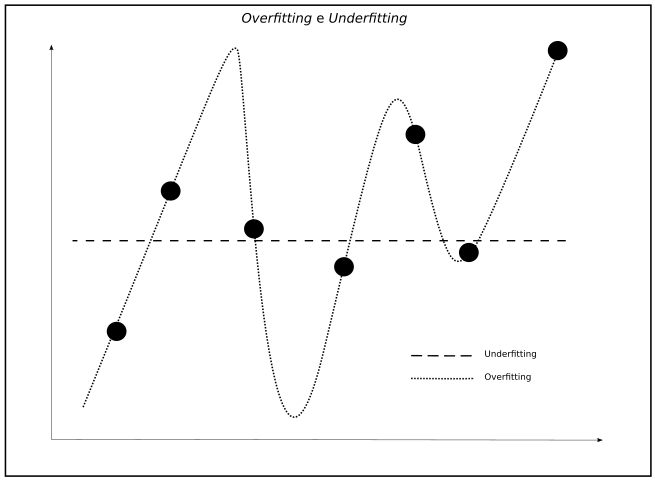
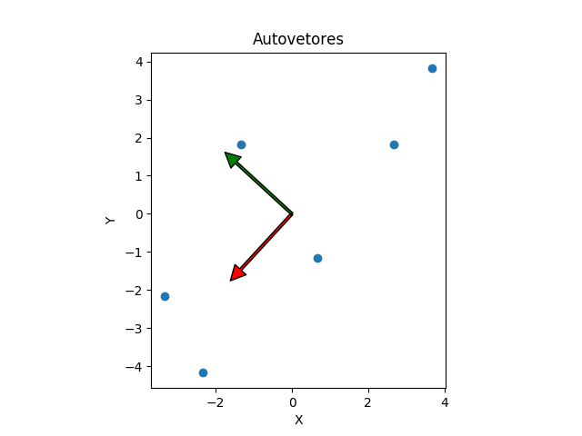
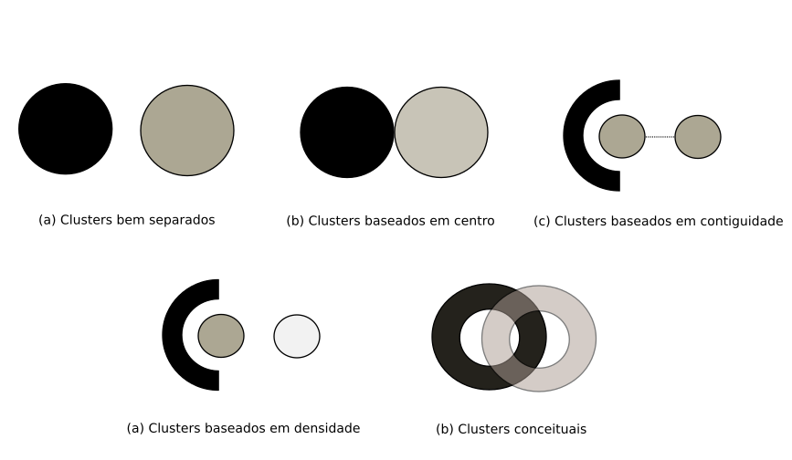

# Aprendizado de Máquina {#sec:ml}

O Aprendizado de Máquina é um subconjunto da Ciência de Dados em que algorítmos de computador são usados para descobrir, de forma autônoma, estruturas presentes em dados e informações através da implementação de sofisticadas técnicas estatísticas de aprendizado. Os métodos estudados nesse Capítulo são de extrema importância para o desenvolvimento do algoritmo de agrupamento do Empurrando Juntos.

Enquanto a Ciência de Dados está intrinsecamente ligada à solução de problemas do mundo real através da coleta, limpeza, formatação e compreensão de dados; o Aprendizado de Máquina se apresenta como uma área do conhecimento que transcende a própria Ciência de Dados, sendo tipicamente descrita como a "ciência cujo objetivo é usar dados existentes para desenvolver modelos que podemos utilizar para predizer várias características de dados futuros" [@dsfs15].

Podemos assim tratar a Ciência de Dados como um grande guarda-chuvas que compreende um conjunto de disciplinas incluindo _Big Data_, Inteligência Artificial, Mineração de Dados e também o Aprendizado de Máquina, configurando uma vasta área de estudos que hoje permite o computador interagir com seres humanos, conduzir um carro, identificar pessoas na multidão e inferir a existência de grupos sociais à partir do comportamento dos indivíduos. Isso é feito com uma eficiência extraordinária, permitindo as máquinas realizarem diversas outras atividades antes ditas humanas e até mesmo sobre-humanas.

A base matemática para grande parte dos algoritmos vem sendo desenvolvida há muitos anos, passando por períodos em que as possibilidades computacionais ainda eram completamente primitivas. Contudo, após o advendo de uma nova geração de computadores com altas taxas de processamento e armazenamento, o Aprendizado de Máquina tornou-se praticamente viável e então, impulsionado por um mundo conectado à _Internet_, que proporcionou uma capacidade inimaginável de coleta massiva de informações, passou a ser largamente introduzido nos nossos empreendimentos e em nosso dia a dia.

## Classificação dos problemas

Quando falamos de Aprendizado de Máquina estamos englobando centenas de algorítmos que utilizamos para treinar e aprimorar nossos modelos. Entre os algoritmos podemos destacar classificadores bayesianos, análise associativa e redes neurais. Esses algoritmos podem ser divididos em três diferentes categorias básicas: supervisinados, não supervisionados e por reforço.

Considere uma máquina que receba uma sequência de entradas $x_{1}, x_{2}, x_{3}, ..., x_{t}$, onde $x_{t}$ é a entrada fornecida no tempo $t$. Essas estradas são dados que podem ser, por exemplo, uma representação do mundo real como _pixels_ de uma imagem, pontos discretos em uma onda mecânica ou votos em uma conversa _online_. A maneira como iremos receber esses dados e projetar nossos algoritmos para lidar com eles define o tipo de aprendizado que melhor se adapta ao nosso problema.

O aprendizado supervisionado recebe uma sequência de entradas $y_{1}, y_{2}, ..., y_{n}$, suas respectivas saídas $z_{y_{1}}, z_{y_{2}}, ..., z_{y_{n}}$ e tem como objetivo produzir uma saída correta para um novo valor $y$ fornecido. O aprendizado por reforço interage com o ambiente produzindo ações $a_{1}, a_{2}, ..., a_{n}$, que retornam algum tipo de resultados escalares $r_{y_{1}}, r_{y_{2}}, ..., r_{y_{n}}$, que recompensam ou não cada ação realizada. Esse resultado é utilizado para aprimorar o algoritmo de forma que recompensas por ações futuras sejam maximizadas. Já o aprendizado não supervisionado recebe uma sequência de entrada $x_{1}, x_{2}, ..., x_{3}$, porém não recebe nenhuma informação adicional sobre esses dados. Então o algoritmo é capaz de identificar padrões nesses dados e utilizar essa informação para agrupá-los ou predizer valores para dados futuros [@zgh04].

Levando em consideração a natureza do problema estabelecido para o desenvolvimento de uma plataforma de participação social baseada no agrupamento de usuários por meio da análise de seus votos, essa seção apresenta um estudo aprofundado nas categorias de algoritmos supervisionados e não supervisionados.

### Aprendizado supervisionado

O aprendizado supervisionado é uma categoria básica de algoritmos que implementam um método guiado por padrões pré-existentes e características já conhecidas para a inferência automatizada de valores futuros. O fluxo genérico desses algoritmos consiste primeiramente na apresentação de um conjunto de dados para a máquina já com seus respectivos corretos valores de saída. A partir desse conjunto, os algoritmos decifram padrões e desenvolvem modelos de aprendizagem capazes de comparar os resultados obtidos nessa fase inicial de treinamento para classificar novos dados.

Para melhor explicar o funcionamento de um algoritmo supervisionado, podemos seguir o exemplo clássico da classificação de _e-mails_. Nesta situação, temos um problema em separar as mensagens recebidas em duas categorias _spam_ e _non-spam_. Partimos do pressuposto que já possuímos uma série de _e-mails_ que se enquadram nesses dois conjuntos, sendo cada um deles rotulado respectivamente com o identificador de sua categoria. Processamos esse conjunto de dados em determinado algoritmo que pode, dessa forma, compreender as características dos dois conjuntos, se tornando capaz de discernir a qual deles pertence um novo _e-mail_ fornecido e não identificado baseando-se na comparação com os resultados previamente obtidos.

O grande desafio a ser vencido quando se faz uso desse tipo de algoritmo é possuir inicialmente um conjunto de dados rotulados grandes o suficiente para representar todas as possíveis variações. Esse conjunto de dados deve, além de tudo, ser o mais relevante possível, isto é, apresentar as características dos padrões com maior fidelidade e de maneira não viciada [@dsfs15].

Regressão linear, _k-nearest neighbors_ e árvores de decisão são exemplos de algoritmos supervisionados.

#### _Overfitting_ e _Underfitting_

Alguns perigos são bem conhecidos quando falamos de Aprendizado de Máquina, dois deles, _overfitting_ e _underfitting_, estão intrinsecamente relacionados a quantidade de informação que nós decidimos analisar em um conjunto de dados, assim como o método escolhido para realizar essa análise.

Podemos descrever um caso de _overfitting_ quando produzimos um modelo que se adequa bem ao conjunto de dados que usamos para o treinamento, entretanto está tão rigidamente vinculado a esse conjunto de dados que não é capaz de se generalizar de modo que esteja ápto a realizar predições coerentes para novos dados de entrada. Opostamente, temos os casos de _underfitting_, que podem ser observados quando o modelo que construímos não se adequa bem ao conjunto de dados de treinamento e consequentemente não é confiável para realizar predições.



A abordagem fundamental para garantir que nosso modelo não está ou complexo ou simples demais é utilizar diferentes dados para treinar e para testar nossos modelos, garantindo. Uma possível forma para aplicar esse conceito é dividir o conjunto de dados disponíveis em dois grupos; um deles será direcinado ao treinamento, o outro ao teste. Assim podemos aferir a performance do modelo. Uma pratica comum nessa abordagem é separar dois terços dos dados para o treinamento.

Um grande desafio de se encontrar um modelo que melhor se adequa ao conjunto de dados selecionado é garantir qual deles é realmente o superior a partir da análise dos resultados para o conjunto de teste. Para o autor, essa aferição seria uma espécie de meta-treinamento que faria com que o próprio conjunto de teste se tornasse um treinamento secundário incapaz de dizer qual dos modelos seria o melhor para a ocasião [@dsfs15] . Logo, nos casos em que utilizamos um conjunto de dados para treinar, testar e selecionar em um grupo de possíveis modelos, devemos dividir os dados disponíveis em três conjuntos: o conjunto de treinamento para a construção dos modelos, o conjunto de validação para escolher entre os modelos e, por fim, um conjunto de teste para julgar o modelo final. É claro que isso apenas irá mitigar o problema, já que podemos extender o mesmo argumento sobre meta-treinamentos para quantas forem as etapas de teste.

#### Validação de um modelo

Quando falamos de acurácia em Aprendizado de Máquina nos referimos ao grau de exatidão, ou seja, ao grau de conformidade de um valor medido ou calculado em relação à sua definição, demonstrado por um modelo específico. Podemos então criar a falsa impressão de que essa seria uma boa forma de avaliar a corretude e aplicabilidade do nosso modelo, entretanto, tipicamente não podemos utilizar essa medida para avaliar se um modelo é adequado o suficiente [@dsfs15].

Retomando o exemplo clássico do modelo binário para identificação de _spams_, cada _e-mail_ rotulado se enquadra em uma das seguintes categorias:

| | |
|---|---|
|Verdadeiro Positivo| _e-mail_ é um _spam_ e foi classificado como _spam_|
|Falso Positivo| _e-mail_ não é um _spam_ e foi classificado como _spam_|
|Verdadeiro Negativo| _email_ não é um _spam_ e não foi classificado como _spam_|
|Falso Negativo| _email_ é um _spam_ e foi classificado como _spam_ |
: Exemplo de categorias em um modelo preditivo binário

Generalizando, para modelos preditivos binários podemos definir a seguinte tabela:

| | 1 | 0 |
|:---:|:---:|:---:|
| **predição 1** | Verdadeiro Positivo | Falso Positivo |
| **predição 0** | Falso Negativo | Verdadeiro Negativo |
: Generalização de um modelo preditivo binário

Assim temos a acurácia $a$ definida como

$$a=(p_{v}+n_{v})/(p_{v}+n_{v}+p_{f}+n_{f}),$$ {#eq:acuracia}

em que $p_{v}$ são as predições verdadeiras positivas, $p_{f}$ as falsas positivas, $n_{v}$ as verdadeiras negativas e $n_{f}$ as falsas negativas.

Considere um modelo de aprendizado hipotético para detecção de _spams_ para o qual foram encontrados os seguintes valores:

| | _spam_ | _non-spam_ |
|:---:|:---:|:---:|
| **predição _spam_** | 100 | 5.000 |
| **predição _non-spam_** | 10.000 | 100.000 |

O valor referente à acurácia, nesse caso, seria de aproximadamente 0.87, levando a crer que esse poderia ser um modelo eficiente para muitas aplicações, já que quanto mais próximo de 1, maior o grau de exatidão obtido. Entretanto, devemos recorrer a outros métodos matemáticos para saber se este realmente poderia ser uma escolha viável. A combinação entre precisão e revocação pode ser utilizada para melhor garantir a viabilidade de um modelo [@dsfs15]. Definimos precisão $p$ e revocação (do ingês _recall_) $r$ como

$$p=p_{v}/(p_{v}+p_{f}),$$ {#eq:precisao}
$$r=p_{v}/(p_{v}+n_{f}).$$ {#eq:revocacao}

Esses valores nos darão respectivamente a compreensão percentual sobre quantos verdadeiros positivos obtivemos no universo de predições positivas e quantos verdadeiros positivos foram preditos no universo de todos os realmente positivos. Para nosso caso hipotético, encontramos para a precisão um valor de aproximadamente 0.02, enquanto para a revocação temos 0.01. Claramente este modelo preditivo não pode ser considerado adequado.

Podemos inferir que

> _"um modelo que prediz sim até quando não tem muita confiança no resultado terá provavelmente uma alta revocação mas uma baixa precisão; um modelo que prediz sim apenas para quando tem extrema confiança no resultado provavelmente terá uma baixa revocação e uma boa precisão"_ [@dsfs15].

### Aprendizado não supervisionado

Nos referimos a uma situação de aprendizado não supervisionado quando estamos lidando com um problema no qual não se obtém previamente nem rótulos para nossas entidades, nem informações adicionais do ambiente a cerca delas. Isso quer dizer que nossos dados não possuem padrões conhecidos que serviriam como base para nossas análises. Mesmo assim podemos desenvolver um modelo formal de aprendizado baseado na noção de que o objetivo da máquina é criar representações dos dados de entrada que podem ser utilizadas para tomada de decisões, predição de dados futuros, etc.

A ciência por trás dessa classe de algoritmos pode ser tratada em termos da procura por um modelo probabilistico dos dados. Isso significa que, até quando não possuímos um conjunto de dados de treinamento, podemos estimar um modelo que representa a distribuição de probabilidade para um novo dado de entrada $x_{t}$, dado um conjunto de entradas $x_{1}, x_{2}, ..., x_{t-1}$. Temos assim um modelo probabilístico $P(x_{t}|x_{1}, x_{2}, ..., x_{t-1})$. Para casos mais simples onde não importa a ordem dos dados de entrada, podemos definir todos os dados independentemente e identicamente em alguma distribuição $P(x)^2$ [@zgh04].

Essas interpratações probabilísticas acerca desses algoritmos, ainda que sejam desejadas, nem sempre condizem com a realidade de suas concepções. Há uma quantidade significativa de modelos eurísticos nos quais a conexão com a Probabilidade pode nem existir, ou ainda, ser estabelecida após sua criação.

Considere um exemplo em que $x$ representa o padrão de comportamento de pessoas em uma conversa _online_. $P(x'|X)$ é construído a partir dos dados coletados de uma pessoa da dessa conversa e depende do conjunto $X=[x_{1}, x_{2},...,x_{n}]$. A probabilidade do comportamento de outra pessoa pode ser validada por esse modelo. Assim, se o valor obtido é muito baixo, podemos concluir que ou essas duas pessoas possuem padrões de comportamento muito diferentes ou nosso modelo não é suficientemente bom para inferir essa informação. Esse tipo de estratégia é muito utilizado para a detecção de anomalias em um conjunto de dados.

Claro que esse não é o único uso pertinente para os algoritmos de aprendizado não supervisionados. No contexto do Empurrando Juntos, a classificação de dados é também uma área de grande importância e interesse. Assumindo $P(x| \theta_{A})$ como um modelo extraído do comportamento de um grupo $A$ de pessoas em uma conversa _online_, e o modelo $P(x| \theta_{B})$ extraído de um grupo $B$, o algoritmo é capaz de inferir a qual grupo pertence uma nova pessoa $p$, que apresenta determinando comportamento $x_{p}$, comparando as probabilidades relativas a cada grupo, $P(x_{p}| \theta_{A})$ e $P(x_{p}| \theta_{B})$ [@zgh04].

Além desses usos, podemos citar a aplicação de algoritmos não supervisionados no desenvolvimento de sistemas de comunicação eficientes e compressão de dados, configurando uma ligação importante entre as áreas de aprendizado de máquina, estatística e teoria da informação [@zgh04].

Não há um modelo que resolva todos os problemas de aprendizado. O grande desafio é desenvolver um que seja apropriado para um conjunto específico de dados levando em consideração propriedades desejadas. A ferramenta de participação social Pol.is, descrita na [@sec:polis], utiliza um algoritmo não supervisionado para agrupar pessoas de acordo com seus respectivos votos em determinados comentários. Os grupos formados servem como referência para que possamos inferir caracteristicas semelhantes em determinado subconjunto de usuários, entretanto o algoritmo não revela explicitamente quais caracteristicas são essas, que podem ser completamente abstratas, impossibilitando várias análises posteriores sobre esses grupos. Podemos formar o grupo das pessoas mais politicamente incoerentes, por exemplo, o que não teria valor prático algum para a maior parte das pesquisas sociais. Isso pode ser uma grande desvantagem dependendo do tipo de informação que se deseja obter desses grupos.

A seguir, apresentamos o embasamento teórico necessário para aprofundar essa e outras discussões em relação ao agrupamento de usuários com algoritmos não supervisionados. Os tópicos discutidos servirão de base para a formulação da proposta de uma arquitetura de _software_ apropriada para o módulo matemático da plataforma Empurrando Juntos.

### Representação dos dados

Para que seja possível analisar um certo agrupamento de dados é necessário identificar quais informações podem ser utilizadas para representar uma abstração prática dos objetos a serem agrupados. É preciso encontrar então um conjunto de atributos que descrevem os itens para que seja possível calcular o grau de semelhança entre os elementos. Esses atributos, por sua vez, podem ser escritos em forma numérica, categórica, binária e uma variedade de outros tipos. Como exemplo, podemos representar pessoas em vetores compostos pelo valor numério de seu ano de nascimento e um valor binário, 0 ou 1, para masculino ou feminino.

$$
  \begin{pmatrix}
    pessoa_{1} \\
    pessoa_{2} \\
    \vdots \\
    pessoa_{n}
  \end{pmatrix}
  =
  \begin{pmatrix}
    1997 & 1 \\
    1943 & 0 \\
    \vdots  & \vdots \\
    ano_{n} & sexo_{n}
  \end{pmatrix}
$$

Vejamos também que a representação de atributos para os objetos podem existir em diferentes formatos e escalas.

|Objeto|Cor|
|:---:|:---:|
|A|Azul|
|B|Amarelo|
|C|Vermelho|
:Representação nominal sobre a cor {#tbl:rep1}

|Objeto|Azul|Amarelo|Vermelho|
|---|---|---|---|
|A|1|0|0|
|B|0|1|0|
|C|0|0|1|
:Representação categórica para o atributo cor {#tbl:rep2}

|Objeto|Cor(THz)|
|---|---|
|A|606|
|B|508|
|C|400|
:Representação numérica da cor em frequência (THz) {#tbl:rep3}

As [@tbl:rep1, @tbl:rep2, @tbl:rep3] mostram os mesmos dados representados de formas diferentes, o formato depende basicamente da fonte de dados, de como eles forma armazenados. Para as diversas representações existe um tipo de função de distância compatível. É possível, no entanto, utilizar qualquer uma das representações.

### Extração de _features_ {#sec:extracao}

_Feature_ é sinônimo para variável de entrada ou atributo [@fefa06]. Selecionar um bom conjunto de _features_ para representar os objetos de um domínio específivo está entre os diversos desafios que podemos encontrar ao tentar desenvolver um modelo apropriado para nosso problema. Em um exemplo clássico da aferição de um diagnóstico médico, podemos selecionar febre, nível de glicose, dores nas articuções como _features_ capazes de descrever bem, em conjunto, determinados tipos de doença.

A expertise humana, que é sempre necessária para converter dados crus em um conjunto de _features_ úteis, pode ser complementada pelos métodos automáticos de construção. Em alguns casos essa etapa está embutida no próprio processo de modelagem, em outros constitui uma etapa de pré-processamento de dados [@fefa06]. Essa etapa é importante quando há um conjunto de dados que podem apresentar inconsistências, estarem incompletos, serem ruidosos, etc.

Desta forma, considere $X$ um dado representado em sua forma original, ou seja, não pré-processado, por um vetor de $n$ caracteristicas, $X=[x_{1}, x_{2}, ..., x_{n}]$. Assim, chamamos de $X'$ o vetor $n'$-dimensional que representa $X$ transformado após o pré-processamento, $X'=[x'_{1}, x'_{2}, ..., x'_{n'}]$. Essa transformação pode incluir, entre outras, as seguintes tarefas [@fefa06]:

* **Padronização**: Adequação de escalas, unidades de medidas, tipos de variáveis, normalização, etc. entre _features_ que representam informações comparáveis entre si.
* **Normalização**: Busca pela obtenção do grau ótimo de organização de uma informação, reduzindo dependências, redundâncias, etc.
* **Extração de _features_ locais**: Utilização de técnicas para incluir informações específicas do domínio entre as _features_.
* **Redução de dimensionalidade**: Quando a dimensionalidade do dado é muito alta, algumas técnicas podem ser aplicadas para reduzir esse espaço dimensional mantendo a maior quantidade de informação possível. A [@sec:pca] descreve um desses métodos, o PCA (Análise de Componentes Principais). As coordenadas dos pontos que representam os dados em um espaço dimensional reduzido podem ser usadas como _features_ ou simplesmente para possibilitar ou facilitar a visualização desses dados.
* **Expansão não-linear**: Aumenta o espaço dimensional do dado com o objetivo de derivar bons resultados em algoritmos que solucionam problemas complexos e que não respondem bem à dimensões reduzidas.

A construção e a seleção de _features_ são atividades complementares que definem o processo de extração de _features_. A seleção tem como objetivo primordial filtrar as _features_ mais relevantes e informativas, mas também pode ter outras motivações como a busca por melhora de performance, economia de recursos físicos, como disco rígido ou memória RAM, entre outras [@fefa06].

A natureza da proposta do Empurrando Juntos faz com que os dados obtidos a partir da participação de usuários em conversas, os votos em comentários, sejam extremamente bem comportados, evitando um grande esforço no processo de construção de _features_. Já o número de _features_ é definido pela quantidade de comentários de uma conversa. Desse modo, mais uma vez buscando garantir os princípios democráticos sobre os quais a plataforma se apresenta, cada comentário possui necessariamente o mesmo valor, impossibilitando a seleção das _features_ mais representativas. Contudo, a redução da dimensionalidade tem um papel crucial para a visualização dos grupos de opinião construídos pelo algoritmo de agrupamento da plataforma, a [@sec:visualizacao] evidencia essa discussão e apresenta possíveis abordagens.

### Visualização {#sec:visualizacao}

As observações sobre o mundo real são, na maioria das vezes, complexas e de difícil abstração quando tentamos representá-las no universo computacional. A análise de um conjunto de dados pode ser impraticável sem que esse conjunto seja antes pré-processado, como foi elucidado na [@sec:extracao]. Por exemplo, em casos onde a medida de similaridade é sensível a diferenças de magnitudes e escalas das variáveis de entrada, como a distância euclideana, é necessário realizar a normalização dos valores [@tall17].

Como veremos no Capítulo [-@sec:ej], o Empurrando Juntos foi contruído com uma forte dependência inicial da ferramenta Pol.is. A popularidade desta ferramenta se deu principalmente pela facilidade com que permite os usuários visualizarem a qual grupo de opinião pertencem. Entretanto, agrupar esses usuários e apresentar esses grupos de uma maneira amigável não é uma tarefa simples.

Cada comentário realizado em uma conversa amplia o espaço dimensional do nosso conjunto de dados. Normalmente temos dezenas de comentários em cada conversa, ou seja, os algoritmos utilizados precisam lidar com o agrupamento de pessoas em dezenas de dimensões distintas e apresentar essa informação ao participante. Uma projeção desses dados em um espaço dimensional reduzido é inevitável se o objetivo é torna-los compreensíveis aos seres humanos, portanto há necessariamente uma perda significante de informação.

Um dos grandes desafios no projeto da plataforma Empurrando Juntos é encontrar o melhor fluxo de processamento e selecionar algoritmos capazes de apresentar os grupos de opinião em um espaço bidimensional mantendo a maior quantidade de informação possível. A maneira como o Pol.is realiza essa tarefa inclui um pré-processamento dos dados para a redução da dimensionalidade, e só então, o seu agrupamento. Como veremos na [@sec:pca], esse fluxo prejudica a aferição da semelhança de opinião entre os usuários, pondendo gerar resultados consideravelmente distorcidos de acordo com as características dos dados originais [@tall17]. As seções a seguir descrevem algumas tecnicas utilizadas para esta transformação e fornecem o embasamento para projetar o fluxo que melhor se adequa a proposta do Empurrando Juntos.

### PCA {#sec:pca}

A Análise dos Componentes Principais (PCA) é provavelmente a mais antiga e mais bem conhecida técnica de análise multivariada. Foi primeiramente introduzida por Pearson em 1901 e desenvolvida independentemente por Hotelling década de 40. Assim como várias outros métodos de análise multivariada, o PCA não foi largamente utilizado até o advento de computadores capazes de processar um número massivo de dados. Contudo, hoje é incluído praticamente em todo pacote estatístico de computação [@joll02].
 
#### Definição

A ideia central por trás dessa técnica é a redução da dimensionalidade de um conjunto de dados que contenha um grande número de variáveis interrelacionadas, enquanto tenta preservar, da melhor maneira possível, a informação contida nesse conjunto.

A quantidade de informação é fortemente relacionada com a variação presente nos dados. Esta pode ser obtida através do cálculo da dispersão, que se refere a medição do espalhamento dos dados [@dsfs15]. A variância é uma medida estatística de dispersão que indica o quão longe em geral um dado $X=[x_{1}, x_{2}, ..., x_{n}]$ se encontra de um valor esperado $E(X)$,

$$
  E(X)=\sum_{i=1}^n x_{i}P(x_{i}),
$$ {#eq:esperado}

em que $P(x_{i})$ representa as probabilidades obtidas para cada elemento de $X$. Assim, se $\mu = E(X)$, definimos a variância $\mathrm{VAR}(X)$ como

$$
  \mathrm{VAR}(X) = E((X - \mu)^2).
$$ {#eq:variancia}

Em termos práticos podemos expressar a [@eq:variancia] como a média do quadrado da distância de cada ponto até a média total dos valores $x_{i}$. Enquanto a variância mede o desvio de uma única variável em relação a média, outra medida, chamada covariância, mede o quanto duas variáveis, $X$ e $Y$, variam em conjunto das suas médias. Define-se covariância $\mathrm{COV}(X, Y)$ como

$$
  \mathrm{COV}(X,Y)=\sum _{i=1}^{n}\left[\left(x_{i}-\mu _{i}^{x}\right)\left(y_{i}-\mu _{i}^{y}\right)P(x_{i},y_{i})\right],
$$ {#eq:covariancia}

em que $P(x_{i},y_{i})$ é a probabilidade de ocorrer o par $(x_{i},y_{i})$. Então, se o PCA tem como objetivo transformar nosso conjunto de dados em um novo conjunto com menor dimensionalidade, contendo a maior quantidade de informação possível, procura-se o conjunto de variáveis com os maiores valores de variância e covariância possíveis.

Uma análise precisa da covariância não é simples pelo fato do resultado não ser normalizado em uma escala, isso quer dizer que é difícil discernir qual é a magnitude dessa representação. Para solucionando esse problema, utilizamos o coeficiente de correlação $\mathrm{COR}(X,Y)$, que é a covariância dividida pelos desvios padrão $\sigma$de cada variável,

$$
  \mathrm{COR}(X,Y)=\frac{\mathrm{COV}(X,Y)}{\sigma_{X} \sigma_{Y}}.
$$ {#eq:correlacao}

Uma perfeita correlação corresponde ao valor 1, enquanto uma anti-correlação total corresponde ao valor -1. 

#### Implementação

O funcionamento do PCA se baseia primeiramente na extração uma matriz de covariância dos dados. Então, calcula-se os autovetores e autovalores dessa matriz, obtendo um autovetor para cada uma das variáveis. Os respectivos autovalores descrevem a variância ([@eq:variancia]) relativa ao conjunto de dados. Os componentes com menor contribuição para a variância são descartados e assim tem-se o conjunto de dados projetado com dimensões reduzidas.

Considere o conjunto bidimensional de dados $A$ mostrados na [@tbl:dadospca]. Como exemplo, aplicaremos o PCA para obter um novo conjunto unidimensional $A'$ que represente a maior parte da informação contida em $A$. A [@fig:exemplo_01_pca] apresenta o conjunto original sobre o plano cartesiano.

|Identificador|X|Y|
|:---:|:---:|:---:|
|A|8|9|
|B|3|7|
|C|5|4|
|D|7|7|
|E|1|3|
|F|2|1|
: Conjunto bidimensional de dados $A$ {#tbl:dadospca}

{#fig:exemplo_01_pca}

A primeira etapa consiste no uso da [@eq:esperado] para extrair os valores esperados para as variáveis. Então normalizamos o conjunto $A$ em torno de um eixo centralizado sem prejudicar a variância, [@fig:exemplo_02_pca]. Essa normalização é realizada através da subtração do valor esperado em cada variável.

{#fig:exemplo_02_pca}

Após a normalização, utilizamos a [@eq:correlacao], para extrair a matriz de coeficientes de correlação, apresentada na [@tbl:correlacao].

||X|Y|
|:---:|:---:|:---:|
|X|1.0|0.7779|
|Y|0.7779|1.0|
: Matriz de correlação para as variáveis X e Y {#tbl:correlacao}

Podemos observar que os valores da diagonal principal correspondem a uma correlação entre uma variável e ela mesma, que por definição deve ser perfeita. A diagonal secundária apresenta a correlação entre X e Y, ou seja, a maneira como as variáveis se relacionam. Para medidas de correlação positivas, os valores variam para mais e para menos juntos; para correlações negativas, quando um valor cresce o outro decresce; por fim, para covarrelações nulas, não há correspondência entre os valores de X e Y.

A próxima etapa consiste na extração dos autovetores e autovalores a partir da matriz de correlação. Os autovetores representam as direções em que estão contidas as maiores variações para esse conjunto de dados. Então, selecionamos os autovetores que possuem os maiores autovalores correspondentes, já que estes são a representação da própria variância. Chamamos estes vetores de componentes principais.

Considere novamente o conjunto de dados $A$. O número de autovetores é igual a quantidade de dimensões dos dados originais. A [@fig:exemplo_04_pca] traça os autovetores sobre o conjunto $A$ normalizado. Observamos claramente que o sentido _vermelho_ possui os maiores autovalores associados, ou seja, é a direção que possui a maior variância acumulada, tornando-a o eixo unidimensional no qual serão projetados os dados.

{#fig:exemplo_04_pca}

Os componentes principais são representações do conjunto de dados original projetados em um espaço dimensional reduzido. A [@fig:exemplo_04_pca] evidencia como a projeção desses dados em eixos que maximizam a variância ocasiona a perda de informações. Contudo, ainda é possível se bter um grau de confiança elevado nos dados obtidos para sua utilização em algoritmos de agrupamento [@tall17], nosso objetivo no Empurrando Juntos.

### _t_-SNE

Apesar do PCA ser uma das técnicas mais utilizadas para redução da dimensionalidade, existem outros métodos populares para visualização de dados com muitas dimensões. A técnica _t_-SNE também é capaz de fornecer uma representação bi ou tridimensional para cada dado. Esse método é uma variação do SNE (_Stochastic Neighbor Embedding_) e produz significantemente melhores visualizações a partir da redução da tendência do acúmulo de dados no centro das representações em dimensões menores. A vantagem do _t_-SNE é a forma como revela estruturas preservando os grupos locais no conjunto de dados [@geof08].

Técnicas lineares de redução de dimensionalidade, como o PCA, buscam uma representação em poucas dimensões de dados com um grau elevado de espalhamento. Entretanto, esses métodos são pouco eficientes quando desejamos representar dados muito similares que estão muito próximos uns dos outros. Para esse tipo de problema, técnicas não-lineares, como o _t_-SNE, podem ser utilizadas, já que evidenciam as diferentes escalas no conjunto de dados.

O _t_-SNE é capaz de capturar grante parte da informação contida individualmente em cada dado, o que chamamos de estruturas locais. Enquanto que, diferentemente de várias outras técnicas não-lineares, também é bastante eficiente na manutenção da estrutura global, como a presença de grupos em várias escalas [@geof08].

#### Definição

Considere que um ponto $x_{i}$ é a representação de um dado em um espaço $\mathbb{R}^{D}$. Um ponto mapeado $y_{i}$ é um ponto em um espaço reduzido, $\mathbb{R}^{2}$ por exemplo. Esse espaço conterá a representação final do conjunto de dados. Essa representação é por definição uma função bijetora, ou seja, cada ponto mapeado $y_{i}$ representa um ponto original $x_{i}$.

Uma vez que temos o conjunto de dados original, desejamos conservar a estrutura desses dados. Em outras palavras, se dois pontos $x_{i}$ e $x_{j}$ estão próximos no espaço $\mathbb{R}^{D}$, desejamos que suas representações em um espaço reduzido $\mathbb{R}^{2}$ também permaneçam próximas. Para isso utilizamos a distância Euclideana entre dois pontos originais $|x_{i} - x_{j}|$ e entre dois pontos mapeados $|y_{i} - y_{j}|$. Primeiramente calculamos a similaridade condicional $p_{i|j}$ entre dois pontos originais, dada por

$$
  p_{i|j} = \frac{exp(-|x_{i}-x_{j}|^2/2
  \sigma _{i}^2)}{\sum_{k\neq i}
  exp(-|x_{i}-x_{k}|^2/2 \sigma _{i}^2)},
$$ {#eq:simgauss}

que nos mostra o quanto dois pontos $x_{i}$ e $x_{j}$ estão próximos, considerando a Distribuição Gaussiana em torno de $x_{i}$ com uma determinada variância $\sigma_{i}^2$.

Podemos assim definir a similaridade $p_{ij}$ como a versão simétrica da similaridade condicional ([@eq:simgauss])

$$
  p_{ij}=\frac{p_{j|i}+p_{i|j}}{2N},
$$ {#eq:simsim}

em que N é o total de pontos contidos no nosso conjunto de dados. Uma vez que é possível obter a similaridade entre dois pontos, podemos calcular uma matriz de similaridade $P$ para todo o conjunto de dados original. Essa matriz é fixa e servirá de comparação para uma segunda matriz de similaridade $Q$ que calcularemos para o conjunto de pontos mapeados $Y = [y_{1}, y_{2}, ..., y_{n}]$.

Para obter a matriz $Q$, utilizaremos ao invés da distribuição Gaussiana apresentada na [@eq:simgauss], a distribuição _t-Student_ com um grau de liberdade, também conhecida como distribuição Cauchy

$$
  f(z)=\frac{1}{1+z^2},
$$

$$
 q_{ij}= \frac{f(|y_{i}-y_{j}|)}{\sum_{k\neq i} f(|y_{i}-y_{k}|)}.
$$

O algoritmo é baseados em itarações que buscam aproximar as matrizes de similaridade. Para isso é necessário minimizar a divergência de Kullback-Leibler $KL(P||Q)$ entre duas distribuições distintas $p_{ij}$ e $q_{ij}$. Essa divergência é uma medida de como duas distribuições de probabilidade divergem uma da outra. No caso simples, $KL(P||Q)=0$ indica que podemos esperar um comportamento muito próximo, se não for igual, de duas distribuições distintas, enquanto $KL(P||Q)=1$ indica que as duas distribuições se comportam de maneiras extremamente diferentes. A divergência de Kullback-Leibler é definida como

$$
  C = KL(P||Q) = \sum_{i,j}p_{ij}\log\frac{p_{ij}}{q_{ij}}.
$$

Para minimizar o valor de $C$ realizamos o calculo do gradiente descendente $\frac{\delta C}{\delta y_{i}}$, que indica a direção para onde os valores mínimos locais se propagam. O gradiente pode ser computado analiticamente por

$$
  g(z)=\frac{z}{1+z^2},
$$

$$
  \frac{\delta C}{\delta y_{i}} = 4 \sum_{j}(p_{ij}-q_{ij})f(|y_{i}-y_{j}|)u_{ij},
$$ 

em que $u_{ij}$ é o vetor unitário que vai de $y_{j}$ até $y_{i}$. O gradiente descendente é inicializado na primeira iteração com uma amostragem de pontos mapeados aleatoriamente em uma curva gaussiana isotrópica com pequena variância centrada em torno da origem. Um _momentum_ grande é necessário para evitar mínimos locais pobres e incoerentes, e acelerar a otimização. Na prática, o gradiente atual é adicionado a uma soma dos gradientes exponencialmente descendentes anteriores para determinar as mudanças nas coordenadas dos pontos do espaço reduzido a cada nova iteração. Analiticamente, a atualização de gradiente no tempo é dada por [@geof08]

$$
 Y_{t} = Y_{t-1}+\eta \frac{\delta C}{\delta Y}+\alpha (t) (Y_{t-1} - Y_{t-2}),
$$

em que $Y_{t}$ representa a o espaço bidimensional $\mathbb{R}^{2}$ na iteração $t$, $\eta$ indica a taxa de aprendizado e $\alpha(t)$ representa o _momentum_ na iteração $t$. A taxa de aprendizado $\eta$ é uma variável adaptativa que gradualmente aumenta nas direções em que o gradiente é mais estável [@geof08].

### _t_-SNE x PCA 

Apresentamos dois algoritmos de redução de dimensionalidade, o _t_-SNE e o PCA. O _t_-SNE possui várias características que corroboram sua escolha em detrimento do PCA se levarmos em consideração o contexto multi-dimensional de agrupamento nas conversas no Empurrando Juntos. A principal delas é a preservação das estruturas locais dos dados, que resulta em uma melhor separação e, consequentemente, em uma melhor distinção dos grupos de opinião. Contudo, há outros pontos importantes que devem ser levados em consideração na escolha de uma primeira abordagem de módulo matemático para a plataforma. 

Primeiramente, o PCA pode ser calculado de forma iterativa, então, se já calculamos as componentes para um espaço com dimensionalidade $D$, necessitamos de pouco processamento para obter uma nova representação para $(D+1)$. O PCA também é capaz de oferecer um histograma sobre os valores originais, já que a projeção dos dados sobre os componentes principais indica a direção do acúmulo de variância. Outro fator de peso é que, uma vez calculada a transformação linear oferecida pelo PCA, esta pode ser aplicada a novos pontos, o que não acontece no _t_-SNE, que utiliza todo o conjunto de dados para calcular os gradientes descendentes. Isso fornece um função bijetiva para os pontos conhecidos, mas não retorna uma função que pode ser aplicada a novos pontos, ampliando significativamente os custos de processamento.

Neste contexto, optamos pelo PCA na proposta de arquitetura inicial do módulo matemátio. Essa escolha não se dá apenas porque existem as vantagens elucidadas acima, mas também porque há correspondência direta com a ferramenta de participação Pol.is, que já possui um respaldo na sociedade e atravessou anos de desenvovlimento. Como veremos no Capitulo [-@sec:ej], existiu desde a concepção do Empurrando Juntos, uma dependência arquitetural relacionada ao Pol.is, desta forma, boa parte das validações as quais a plataforma será submetida, será de cunho comparativo em relação a essa dependência.

Essa decisão acompanhou a formulação de uma arquitetura que permitisse alterações consideraveis no fluxo de processamento de dados com o mínimo de esforço possível. Os padrões e ferramental utilizados estão descritos na [@sec:arquitetura]. Assim, o _t_-SNE se mantém um forte candidato para evoluções futuras de cunho comparativo e substitutivo.

## Clusterização de dados {#sec:clusterizacao}

A funcionalidade primordial no seio da proposta do Empurrando Juntos é o algoritmo que agrupa os participantes de acordo com seus comportamentos. Esses grupos servem de insumo para uma série de outras funcionalidades, que incluem análises estatísticas e modelos de gamificação. Discutimos também sobre a visualização dos dados, que nesse contexto, é propriamente um gráfico bidimensional dos grupos de opinião. Aliados, os algoritmos de visualização e agrupamento são o coração do Empurrando Juntos, evidenciados como algumas das principais características que destacam essa de outras propostas para plataformas de participação social.

Se encaramos, em termos da participação social, a utilização de algoritmos de agrupamento como algo inovador e pouco explorado, não podemos dizer o mesmo sobre sua utilização em larga escala pela Indústria da Informação. O exame minucioso daquilo de que buscamos, clicamos, gostamos e compramos são um prato cheio para que sejamos automaticamente incluídos em grupos de consumo armazenados nas bases de dados de grandes empresas, alvos estratégicos para campanhas publicitárias arrebatadoras. Essa é a visão estatística do sucesso, impulsionada por uma nova geração de máquinas e algoritmos capazes de processar uma massa exorbitante de dados coletados na _Internet_.

Muito embora o exemplo dos sistemas de recomendação seja o mais popular quando o tema é clusterização, termo que usaremos para nos referir ao agrupamento de dados, a aplicação desses algoritmos se dá em diversas esferas do conhecimento. A biologia, por exemplo, dedicou anos para a criação da taxonomia, a classificação hierarquizada para todas as formas conhecidas de vida: reinos, filos, classes, ordens, famílias, gêneros e espécies. Não é coincidência o fato de ser uma das áreas que mais se beneficia do potencial dos algoritmos de clusterização [@ptan05]. Da biologia ao sistema financeiro, a identificação de padrões ocultos em um conjunto de dados é um recurso cada vez mais valorizado pela ciência e pelas pessoas na infindável busca pela compreensão das coisas.

> _"Classes, ou grupos conceitualmente significativos de objetos que compartilham características comuns, desempenham um papel importante na forma como as pessoas analisam e descrevem o mundo. Na verdade, os seres humanos são habilidosos em dividir objetos em grupos (clusterização) e atribuir objetos específicos a esses grupos (classificação)"_ [@ptan05].

### Definição

A clusterização consiste no agrupamento de objetos baseado apenas na informação contida no conjunto de dados que descreve esses objetos e seus relacionamentos. O objetivo é unir dentro de um mesmo grupo, ou _cluster_, objetos que apresentam similaridade entre si e em outros grupos objetos não estão relacionados com este grupo. Quanto maior for a similaridade entre os objetos de um grupo e a diferença entre dois grupos, melhor é a clusterização [@ptan05].

O agrupamento de objetos está relacionado com outras técnicas de classificação utilizadas para dividir objetos em grupos. Contudo, essa semelhança se limita ao fato do próprio algoritmo de clusterização derivar os rótulos de para grupo a partir do conjunto de dados. Não há previamente um modelo extraído de dados de treinamento previamente rotulados. Consequentemente, a clusterização se enquadra na categoria de classificação não supervisionada.

### Tipos de clusterização

A formação de um conjunto de grupos é frequentemente tratado apenas como clusterização, entretanto algumas subcatogorias podem descrever melhor a natureza desses algoritmos:

* **Aninhados e não aninhados**: Uma divisão não aninhada, ou particionada, consiste na separação de um conjunto de dados em grupos que não se sobrepõem. Uma configuração aninhada, ou hierarquica, permite a existência de subgrupos. Nessa organização cada _cluster_ é constituído pela união de seus _subclusters_ filhos, e a raiz é um _cluster_ que contém todos os objetos, como uma árvore.

* **Exclusivos, sobrepostos e distorcidos**: A organização exclusiva atribui um abjeto apenas a um _cluster_, enquanto que a organização por sobreposição permite que esse objeto pertença a mais de um grupo simultaneamente. Seguindo a lógica _Fuzzy_ (distorcida), os objetos pertencem a todos os _clusters_ com determinado grau de pertencimento que vai de 0, indicando um relacionado inexistente, à 1, indicando um relacionamento total.

* **Completos e parciais**: Na distribuição completa, todos os objetos são atribuídos a um _cluster_, enquanto que na distribuição parcial isso não acontece necessariamente, permitindo a existência de objetos que não pertencem a nenhum grupo.

### Tipos de _clusters_

Os grupos formados pelos diferentes tipos de clusterização também possuem suas próprias características de agrupamento, estas característica são definidas princiapalmente pelo algoritmo utilizado e são determinantes na decisão sobre qual deles escolher de acordo com o objetivo da análise dos _clusters_. Esses grupos, ilustrados na [@fig:tipoclusters], podem pertencer às seguintes categorias:

* **_Clusters_ bem separados**: Cada objeto está necessariamente próximo a todos os objetos do seu _cluster_ e relativamente distante de outros objetos.

* **_Clusters_ baseados em centros**: Cada objeto está necessariamente mais próximo do centro de seu _cluster_ do que do centro de outros _clusters_.

* **_Clusters_ baseados em contiguidade**: Cada objeto está mais próximo de ao menos um outro objeto de seu _cluster_ do que de qualquer outro objeto em outros _clusters_.

* **_Clusters_ baseados em densidade**: Os grupos definem regiões de alta densidade e são separados por regiões de baixa densidade.

* **_Clusters_ conceituais**: Objetos são unidos por propriedades genéricas extraídas do conjunto total de dados.

{#fig:tipoclusters}

### _k-means_

Uma das técnicas mais conhecidas no contexto da clusterização é o _k-means_. Este é um algoritmo de agrupamento exclusivo que consiste na minimização iterativa de uma função objetiva capaz de gerar _clusters_ baseados em centros. Essa classe de algoritmos é muito eficiente na clusterização de grandes bases de dados e com alta dimensionalidade quando comparada com outros modelos, apesar de não ser adequada para encontrar _clusters_ com formatos arbitrários [@gang07].

Na prática, o algoritmo exige um parâmetro inicial _k_ que representa o número de _clusters_ desejados. Em cada iteração, os dados são alocados em um conjunto cujo centroide está mais próximo. Os dados associados a um centroide formam um _cluster_. Então, o centroide de cada _cluster_ é recalculado a partir dos seus dados associados. Esse processo é repetido até que não haja alterações significativas nos dados de cada _cluster_ ou, de forma equivalente, nos centroides calculados nas iterações anteriores [@ptan05].

#### Descrição

O algoritmo básico pode ser visualizado na [@lst:kmeans]

```
Selecionar k pontos como centroides iniciais
Repita:
  Forme k clusters associando cada ponto com o centroide mais próximo
  Calcule o centroide de cada cluster
Até que os centroides não mudem
```
: Algoritmo básico do k-means {#lst:kmeans}


A primeira etapa do algoritmo consiste na definição de _k_ pontos aleatórios como centroides iniciais. Os dados, então, são distribuidos também de maneira aleatória entre os _clusters_ definidos por esses centroides. Assim, inicia-se a etapa iterativa do algoritmo, que associa, a cada _cluster_, os dados que possuem a menor distância de seus centros. Os centroides são recalculados ao fim de cada iteração. Essa etapa é repetida até que se atinja um número limite de iterações, que pode ser definido pelo usuário, ou também até que se atinja mínimos locais e qualquer mudança não tenha mais significado prático nas estruturas construídas.

A complexidade do algoritmo, $O(knf)$, pode ser expressa para cada iteração como o produto do número de _clusters_ $k$, da quantidade de pontos $n$ presentes no conjunto de dados, e do número de _features_ $f$. Sua solução converge para ótimos locais e possui natureza NP-difícil. Na prática, isso inviabiliza a execução de todos os arranjos possíveis para que, só então, se escolha a melhor distribuição. Assim, é extremamente importante uma escolha adequada dos parâmetros iniciais, como a quantidade máxima de iterações que serão realizadas e os $k$ centróides selecionados.

Para atribuir um ponto ao centróide mais próximo, precisamos de uma medida de similaridade que possibilite identificar o quão próximo de cada centro está um determinado dado. Nesse contexto, há uma associação direta entre similaridade e medidas de distância. Essas podem ser extraídas por diversos métodos distintos que se comportam ou melhor ou pior dependendo das características dos dados. Por exemplo, a Distância Euclidiana é freqüentemente usada para dados representados por pontos no Espaço Euclidiano, enquanto aproximação por similaridade de cosenos é mais apropriada para documentos complexos [@ptan05].

#### Espaço Euclideano {#sec:euclideano}

Considere um conjunto de $N$ dados para o qual a medida de proximidade seja dada pela Distância Euclideana,

$$
  d(x,y)=\sqrt{\sum_{k=1}^N (x_{k}-y_{k})^2},
$$ {#eq:euclideana}

em que $x_{k}$ e $y_{k}$ são os $k$-ésimos atributos para os dados $x$ e $y$. Precisamos de uma função objetiva para medir a qualidade da clusterização. Podemos usar uma medida de dispersão, como a variância ([@eq:variancia]), na tentativa de minimizar a somatória dos desvios calculados em torno dos valores esperados ([@eq:esperado]), nesse caso, os respectivos centroides. Definimos essa somatoria como

$$
  \mathrm{SSE} = \sum_{i=1}^{k} \sum_{x \in C_{i}} d(C_{i},x)^2,
$$

em que SSE (do ingês _sum of the squared errors_) é a somatória dos quadrados das Distâncias Euclideanas $d$ ([@eq:euclideana]) de cada dado $x$ em relação ao centroide de seu _cluster_ $C_{i}$. Em outras palavras, o algoritmo é simplificado como o cálculo dos desvios quadrados até o centroide mais próximo e então é computado o valor de $\mathrm{SSE}$ para cada arranjo. Assim, dado dois arranjos distintos, escolhemos aquele que possui o menor valor para $\mathrm{SEE}$. Este diz respeito a uma melhor representação dos dados agrupados.

#### Selecionando um valor de _k_

No contexto do Empurrando Juntos, não há previamente uma classificação de padrões esperados que determinariam resultados direcionados para as clusterizações. É necessário então utilizar uma estratégia autocontida, ou seja, que use somente o conjunto de dados fornecido e as inferências automáticas sobre ele. Esse tipo de avaliação é chamada de validação interna. Essas análises buscam responder as perguntas sobre a densidade dos _clusters_ gerados, a coesão da informação contida em cada um deles, etc. Já falamos sobre uma delas, a soma dos erros quadrados apresentada na [@sec:euclideano].

A quantidade de _clusters_ $k$ que precisamos definir durante a inicialização do _k-means_ influencia diretamente na qualidade dos resultados obtidos e, consequentemente, nas análises que serão realizadas a partir desses grupos. A avaliação interna do melhor $k$ possível pode ser feita através da comparação de índices avaliativos extraídos dos resultados obtidos para diferentes parâmetros $k$.

O coeficiente de silhueta se encaixa nesse contexto, e é bastante utilizado como medida de qualidade para auxiliar na seleção do melhor número de _clusters_ $k$ em algoritmos que requerem este parâmetro, como _k-means_ [@tall17]. Essa métrica determina um índice avaliativo para cada dado $x_{i} \in X$ em que $X=[x_{1}, x_{2}, ..., x_{n}]$.

Este coeficiente $s_i$ pode ser obtido através do seguinte algoritmo

```
Atribua cada dado X_i ao seu respectivo cluster C_i em um conjunto de k clusters.
Repita para cada X_i:
  Repita para cada dado Y_i pertencente ao cluster C_i:
    Calcule a distância entre X_i e Y_i
  Até percorrer todos valores Y_i em C_i

  Calcule a média A_i das distâncias obtidas

  Repita para cada cluster C_j diferente de C_i:
    Repita para cada dado Y_j pertencente ao cluster C_j:
      Calcule a distância entre X_i e Y_j
    Até percorrer todos os valores Y_j em C_j
    Calcule a média B_ij das distâncias obtidas
  Até que não haja mais _clusters_ C_j

  Selecione o menor valor B_ij encontrado, B_i
  Calcule o coeficiente se silhueta, S_i = (B_i - A_i) / max(A_i, B_i).
```
: Cálculo do Coeficiente de Silhueta {#lst:silhueta}

O valor do coeficiente de silhueta pode variar entre -1 e 1. Um resultado negativo representa uma clusterização indesejada, já que indica que a média das distâncias calculadas dentro do _cluster_ do próprio dado é maior do que a menor distância encontrada entre as médias calculadas para os dados de outros _clusters_. Nesse sentido, procura-se um valor _k_ que melhor aproxime A_i de 0 para que o coeficiente de silhueta atiginja um resultado próximo do seu máximo [@ptan05].

Se $C_i$ é o _cluster_ que contém o dado $x_i$, $b_{i_{min}}$ é a menor média de distâncias encontradas para $x_i$ em relação aos dados de um _cluster_ $C_j | C_j \cap C_i = \varnothing$, e $a_i$ é a distância média de $x_i$ calculada em relação aos outros dados de $C_i$, podemos expressar matematicamente o cálculo do coeficiente silhueta $\mathrm{SIL}(x_i)$ como 

$$
  \mathrm{SIL}(x_i) = \frac{b_{i_{min}} - a_i}{\mathrm{MAX}(a_i, b_{i_{min}})}.
$$

Então, os coeficientes podem ser aplicados para extrair uma medida geral de silhueta para cada _cluster_ $C_i$, ou ainda, para todo o conjunto de _clusters_ $C=[C_1, C_2, ..., C_k]$. Para isso, uma vez que possuímos todos os coeficientes $\mathrm{SIL}(x_i)$, calculamos a média dos coeficientes correspondentes ao dados dos conjuntos desejados de acordo com

$$
  \mathrm{SIL}(C_{i}) = \frac{\sum_{x_i \in C_i} \mathrm{SIL}(x_i)}{N_{C_{i}}},
$$

$$
  \mathrm{SIL}(C) = \frac{\sum_{i=1}^k \mathrm{SIL}(C_i)}{k},
$$

em que $N_{C_{i}}$ é o número de dados contidos no conjunto $C_i$, e $k$ é o número de _clusters_ que desejamos otimizar. Assim, descrevemos um método capaz de comparar diferentes arranjos de $k$ _clusters_ e nos fornecer uma resposta para qual seria o melhor deles de acordo com as características dos dados.

#### Discussão {#sec:polisdiscussao}

Vimos nas Seções anteriores o embasamento teórico necessário para compreender o método de clusterização que conceberá o módulo matemático do Empurrando Juntos. Martins [-@tall17] detalhou partes importantes do Pol.is em seu trabalho, e desenhou um protótipo do que viria a ser a base arquitetural para a infraestrutura de clusterização do Empurrando Juntos. Entre os diversos métodos de pré-processamento, clusterização e validação analisados, tomou a decisão de reproduzir o fluxo de processamento do Pol.is. Os motivos que englobam essa decisão podem ser descritos em torno do estudo científico de cunho comparativo entre uma ferramenta já bem estabelecida na sociedade, o Pol.is, e a concepção de uma plataforma que extende suas funcionalidades, o Empurrando Juntos.

Com base no que mostramos, podemos encontrar diversos aspéctos críticos no esboço da arquitetura proposta pelo Pol.is, cujo núcleo se concentra no processamento dos dados em duas etapas sequenciais. A primeira é o pré-processamento com a aplicação do PCA para redução da dimensionalidade dos dados em uma conversa, e a segunda, a sua clusterização realizada através do método _k-means_. À princípio, destacamos o grande problema da perda de informações sensíveis nas transformações lineares durante a primeira etapa. Essas informações, que nesse caso podem ser tratadas como distâncias entre pontos, são essenciais para uma clusterização eficiente dos dados. Dependendo do contexto, essa perda pode degenerar os _clusters_, sacrificando qualquer tentativa posterior de se inferir informações úteis sobre os grupos formados. Esse fato vai de encontro com os pilares da proposta do Empurrando Juntos, que veremos no Capítulo [-@sec:ej].

A estima do Pol.is por uma visualização bidimensional dos dados clusterizados acarretou uma série de problemas conceituais sobre os grupos gerados. Na prática, uma simples inversão das etapas: primeiro a clusterização e depois a redução da dimensionalidade, faria um enorme sentido estatístico. Entretanto, a projeção dos pontos em um espaço dimensional reduzido, que possibilitasse a visualização humana, ocasionaria uma sobreposição dos _clusters_, o que possui uma coerência com a realidade da informação, mas prejudica a distinção de grupos bem formados.

Este e outros fatos alteraram consideravelmente o planejamento inicial de construção da plataforma, na qual o Empurrando Juntos meramente extenderia as funcionalidades do Pol.is. Essas alterações, como explicaremos no Capítulo [-@sec:ej], reduziram o Pol.is a uma dependência arquitetural momentânea, que influenciou diversos aspectos das primeiras versões do Empurrando Juntos, incluindo a utilização do mesmo fluxo de processamento de dados. Entretanto, conscientes das fragilidades dos métodos e fluxos aplicados no Pol.is, projetamos uma arquitetura de _software_ para o módulo matemático do Empurrando Juntos que fosse completamente desacoplada do conjunto da solução. Essa arquitetura possibilita tanto pequenas alterações pontuais nos algoritmos, quanto sua completa substituição, demandando poucos esforços técnicos. Destrincharemos, na [@sec:arquitetura], a concepção desse modelo arquitetural que possibilita a evolução gradativa dos métodos de clusterização aplicados.
